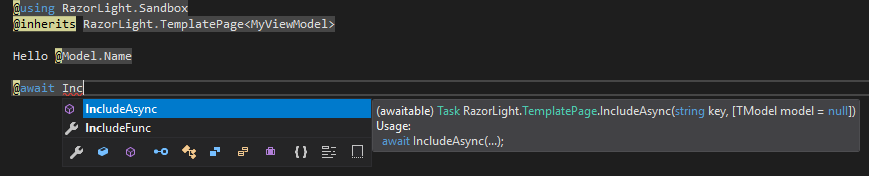

<!--
GENERATED FILE - DO NOT EDIT
This file was generated by [MarkdownSnippets](https://github.com/SimonCropp/MarkdownSnippets).
Source File: /README.source.md
To change this file edit the source file and then run MarkdownSnippets.
-->

# RazorLight

Use Razor to build templates from Files / EmbeddedResources / Strings / Database or your custom source outside of ASP.NET MVC. No redundant dependencies and workarounds in pair with excellent performance and **.NET Standard 2.0** and **.NET Core 3.0** support.

[](https://travis-ci.org/toddams/RazorLight)  [](https://www.nuget.org/packages/RazorLight/) [](https://www.nuget.org/packages/RazorLight/) [](https://gitter.im/Razor-Light)

# Table of contents
- [Quickstart](#quickstart)
- [Template sources](#template-sources)
  * [Files](#file-source)
  * [Embedded resources](#embeddedresource-source)
  * [Database (custom)](#custom-source)
- [Includes (aka Partial)](#includes-aka-partial-views)
- [Encoding](#encoding)
- [Additional metadata references](#additional-metadata-references)
- [Enable Intellisense support](#enable-intellisense-support)
- [FAQ](#faq)

# Quickstart
Install the nuget package using following command:

````
Install-Package RazorLight -Version 2.0.0-rc.3
````

The simplest scenario is to create a template from string. Each template must have a ````templateKey```` that is associated with it, so you can render the same template next time without recompilation.

<!-- snippet: simple -->
<a id='snippet-simple'></a>
```cs
var engine = new RazorLightEngineBuilder()
	// required to have a default RazorLightProject type,
	// but not required to create a template from string.
	.UseEmbeddedResourcesProject(typeof(ViewModel))
	.SetOperatingAssembly(typeof(ViewModel).Assembly)
	.UseMemoryCachingProvider()
	.Build();

string template = "Hello, @Model.Name. Welcome to RazorLight repository";
ViewModel model = new ViewModel {Name = "John Doe"};

string result = await engine.CompileRenderStringAsync("templateKey", template, model);
```
<sup><a href='/tests/RazorLight.Tests/Snippets/Snippets.cs#L16-L30' title='Snippet source file'>snippet source</a> | <a href='#snippet-simple' title='Start of snippet'>anchor</a></sup>
<!-- endSnippet -->

To render a compiled template:

<!-- snippet: RenderCompiledTemplate -->
<a id='snippet-rendercompiledtemplate'></a>
```cs
var cacheResult = engine.Handler.Cache.RetrieveTemplate("templateKey");
if(cacheResult.Success)
{
	var templatePage = cacheResult.Template.TemplatePageFactory();
	string result = await engine.RenderTemplateAsync(templatePage, model);
}
```
<sup><a href='/tests/RazorLight.Tests/Snippets/Snippets.cs#L37-L44' title='Snippet source file'>snippet source</a> | <a href='#snippet-rendercompiledtemplate' title='Start of snippet'>anchor</a></sup>
<!-- endSnippet -->

# Template sources

RazorLight can resolve templates from any source, but there are a built-in providers that resolve template source from filesystem and embedded resources.

## File source

When resolving a template from filesystem, templateKey - is a relative path to the root folder, that you pass to RazorLightEngineBuilder.

<!-- snippet: FileSource -->
<a id='snippet-filesource'></a>
```cs
var engine = new RazorLightEngineBuilder()
	.UseFileSystemProject("C:/RootFolder/With/YourTemplates")
	.UseMemoryCachingProvider()
	.Build();

var model = new {Name = "John Doe"};
string result = await engine.CompileRenderAsync("Subfolder/View.cshtml", model);
```
<sup><a href='/tests/RazorLight.Tests/Snippets/Snippets.cs#L49-L58' title='Snippet source file'>snippet source</a> | <a href='#snippet-filesource' title='Start of snippet'>anchor</a></sup>
<!-- endSnippet -->

## EmbeddedResource source

For embedded resource, key - is a namespace and key of the embedded resource relative to root Type. Then root type namespace and templateKey will be combined into YourAssembly.NamespaceOfRootType.Templates.View.cshtml

<!-- snippet: EmbeddedResourceSource -->
<a id='snippet-embeddedresourcesource'></a>
```cs
var engine = new RazorLightEngineBuilder()
	.UseEmbeddedResourcesProject(System.Reflection.Assembly.GetEntryAssembly())
	.UseMemoryCachingProvider()
	.Build();

var model = new SchoolForAnts();
string result = await engine.CompileRenderAsync<object>("Views.Subfolder.SchoolForAnts", model);
```
<sup><a href='/tests/RazorLight.Tests/Snippets/Snippets.cs#L63-L72' title='Snippet source file'>snippet source</a> | <a href='#snippet-embeddedresourcesource' title='Start of snippet'>anchor</a></sup>
<!-- endSnippet -->

## Custom source

If you store your templates in database - it is recommended to create custom RazorLightProject that is responsible for gettings templates source from it. The class will be used to get template source and ViewImports. RazorLight will use it to resolve Layouts, when you specify it inside the template.

````CSharp
var project = new EntityFrameworkRazorProject(new AppDbContext());
var engine = new RazorLightEngineBuilder()
              .UseProject(project)
              .UseMemoryCachingProvider()
              .Build();

// For key as a GUID
string result = await engine.CompileRenderAsync("6cc277d5-253e-48e0-8a9a-8fe3cae17e5b", new { Name = "John Doe" });

// Or integer
int templateKey = 322;
string result = await engine.CompileRenderAsync(templateKey.ToString(), new { Name = "John Doe" });
````

You can find a full sample [here](https://github.com/toddams/RazorLight/tree/master/samples/RazorLight.Samples)


# Includes (aka Partial views)

Include feature is useful when you have reusable parts of your templates you want to share between different views. Includes are an effective way of breaking up large templates into smaller components. They can reduce duplication of template content and allow elements to be reused. *This feature requires you to use the RazorLight Project system, otherwise there is no way to locate the partial.*

````CSharp
@model MyProject.TestViewModel
<div>
    Hello @Model.Title
</div>

@{ await IncludeAsync("SomeView.cshtml", Model); }
````
First argument takes a key of the template to resolve, second argument is a model of the view (can be null)

# Encoding
By the default RazorLight encodes Model values as HTML, but sometimes you want to output them as is. You can disable encoding for specific value using @Raw() function

````CSharp
/* With encoding (default) */

string template = "Render @Model.Tag";
string result = await engine.CompileRenderAsync("templateKey", template, new { Tag = "<html>&" });

Console.WriteLine(result); // Output: &lt;html&gt;&amp

/* Without encoding */

string template = "Render @Raw(Model.Tag)";
string result = await engine.CompileRenderAsync("templateKey", template, new { Tag = "<html>&" });

Console.WriteLine(result); // Output: <html>&
````
In order to disable encoding for the entire document - just set ````"DisableEncoding"```` variable to true
````html
@model TestViewModel
@{
    DisableEncoding = true;
}

<html>
    Hello @Model.Tag
</html>
````

# Enable Intellisense support
Visual Studio tooling knows nothing about RazorLight and assumes, that the view you are using - is a typical ASP.NET MVC template. In order to enable Intellisense for RazorLight templates, you should give Visual Studio a little hint about the base template class, that all your templates inherit implicitly

````CSharp
@using RazorLight
@inherits TemplatePage<MyModel>

<html>
    Your awesome template goes here, @Model.Name
</html>
````
____


# FAQ

## Coding Challenges (FAQ)

### How to use templates from memory without setting a project?

The short answer is, you have to set a project to use the memory caching provider.  The project doesn't have to do anything.  This is by design, as without a project system, RazorLight cannot locate partial views.

:x:
You used to be able to write:

```c#
var razorEngine = new RazorLightEngineBuilder()
.UseMemoryCachingProvider()
.Build();
```
... but this now throws an exception, saying, "`_razorLightProject cannot be null`".

:heavy_check_mark:
```c#
var razorEngine = new RazorLightEngineBuilder()
                .UseEmbeddedResourcesProject(typeof(AnyTypeInYourSolution)) // exception without this (or another project type)
                .UseMemoryCachingProvider()
                .Build();
```
Affects: RazorLight-2.0.0-beta1 and later.

Original Issue: https://github.com/toddams/RazorLight/issues/250

### How to embed an image in an email?

This isn't a RazorLight question, but please see [this StackOverflow answer](https://stackoverflow.com/a/32767496/1040437).

### How to embed css in an email?

This isn't a RazorLight question, but please look into PreMailer.Net.

## Compilation and Deployment Issues (FAQ)

Most problems with RazorLight deal with deploying it on a new machine, in a docker container, etc.  If it works fine in your development environment, read this list of problems to see if it matches yours.

### Additional metadata references
When RazorLight compiles your template - it loads all the assemblies from your entry assembly and creates MetadataReference from it. This is a default strategy and it works in 99% of the time. But sometimes compilation crashes with an exception message like "Can not find assembly My.Super.Assembly2000". In order to solve this problem you can pass additional metadata references to RazorLight.

````CSharp
var metadataReference = MetadataReference.CreateFromFile("path-to-your-assembly")

 var engine = new RazorLightEngineBuilder()
                .UseMemoryCachingProvider()
                .AddMetadataReferences(metadataReference)
                .Build();
````

### I'm getting errors after upgrading to ASP.NET Core 3.0 when using runtime compilation

Please see: https://docs.microsoft.com/en-us/aspnet/core/razor-pages/sdk?view=aspnetcore-3.1#use-the-razor-sdk

> Starting with ASP.NET Core 3.0, MVC Views or Razor Pages aren't served by default if the `RazorCompileOnBuild` or `RazorCompileOnPublish` MSBuild properties in the project file are disabled. Applications must add an explicit reference to the `Microsoft.AspNetCore.Mvc.Razor.RuntimeCompilation` package if the app relies on runtime compilation to process .cshtml files.


### I'm getting a Null Reference Exception after upgrading to RazorLight-2.0.0-beta2 or later.

The most common scenario is that some people were using RazorLight's ability to render raw strings as templates.  While this is still somewhat supported (you can't use advanced features like partial views), what is not supported (right now) is using the caching provider with raw strings.  A workaround is to use a dummy class.

### I'm getting "Cannot find compilation library" when I deploy this library on another server

Add these property groups to your **entry point csproj**.
It has to be the entry point project.  For example: ASP.NET Core web project, .NET Core Console project, etc.

````XML
  <PropertyGroup>
    <!-- This group contains project properties for RazorLight on .NET Core -->
    <PreserveCompilationContext>true</PreserveCompilationContext>
    <MvcRazorCompileOnPublish>false</MvcRazorCompileOnPublish>
    <MvcRazorExcludeRefAssembliesFromPublish>false</MvcRazorExcludeRefAssembliesFromPublish>
  </PropertyGroup>
````

### I'm getting "Can't load metadata reference from the entry assembly" exception

Set PreserveCompilationContext to true in your *.csproj file's PropertyGroup tag.

````XML
<PropertyGroup>
    ...
    <PreserveCompilationContext>true</PreserveCompilationContext>
</PropertyGroup>
````

Additionally, RazorLight allows you to specifically locate any `MetadataReference` you can't find, which could happen if you're running in SCD [(Self-Contained Deployment) mode](https://docs.microsoft.com/en-us/dotnet/core/deploying/), as the C# Compiler used by RazorLight [needs to be able to locate `mscorlib.dll`](https://github.com/toddams/RazorLight/issues/188#issuecomment-523418738).  This might be a useful trick if future versions of the .NET SDK tools ship with bad MSBuild targets that somehow don't "preserve compilation context" and you need an immediate fix while waiting for Microsoft support.

### I'm getting "Cannot find reference assembly 'Microsoft.AspNetCore.Antiforgery.dll'" exception on .NET Core App 3.0 or higher

By default, the 3.0 SDK avoids copying references to the build output.
Set `PreserveCompilationReferences` and `PreserveCompilationContext` to true in your *.csproj file's PropertyGroup tag.

````XML
<PropertyGroup>
    <PreserveCompilationReferences>true</PreserveCompilationReferences>
    <PreserveCompilationContext>true</PreserveCompilationContext>
</PropertyGroup>
````

For more information, see https://github.com/aspnet/AspNetCore/issues/14418#issuecomment-535107767 (which discusses the above flags) and https://github.com/microsoft/DockerTools/issues/217#issuecomment-549453362 (which discusses that Runtime Compilation feature was marked obsolete in ASP.NET Core 2.2, and removed from the default template in ASP.NET Core 3.0).

### RazorLight does not work properly on AWS Lambda or Azure Functions

Serverless solutions are not supported yet. However, for Azure Functions, some users have reported success on Azure Functions 3.0.3.  As of 6/3/2020, Azure Functions SDK team has acknowledged a [bug in Azure Functions `RemoveRuntimeDependencies` task](https://github.com/toddams/RazorLight/issues/306#issuecomment-636374491), affecting Azure Functions 3.0.4-3.0.6 releases.

For Azure Functions 3.0.4-3.0.5, the known workaround is to disable "Azure Functions dependency trimming".  To disable dependency trimming, add the following to your root / entrypoint project:

```xml
<PropertyGroup>
  <_FunctionsSkipCleanOutput>true</_FunctionsSkipCleanOutput>
</PropertyGroup>
```

In addition, Azure Functions has an open pull request outstanding to update `runtimeAssemblies.json`: https://github.com/Azure/azure-functions-vs-build-sdk/issues/422

## Unsupported Scenarios

### RazorLight does not work with ASP.NET Core Integration Testing

RazorLight is not currently designed to support such integration tests.  If you need to test your RazorLight tests, current recommendation is to simply create a project called `<YourCompanyName>.<YourProjectName>.Templating` and write your template rendering layer as a Domain Service, and write tests against that service.  Then, you can mock in your integration tests any dependencies on RazorLight.

If you happen to get this working, please let us know what you did.
